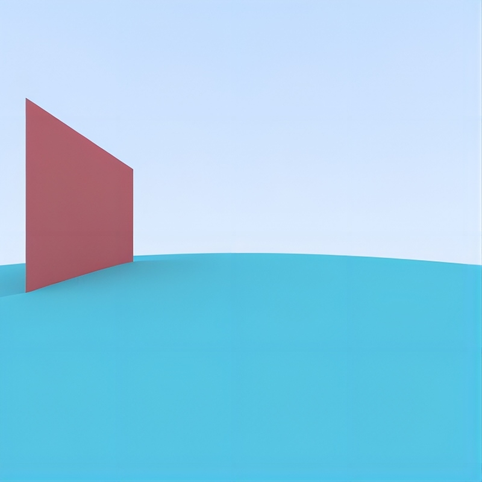
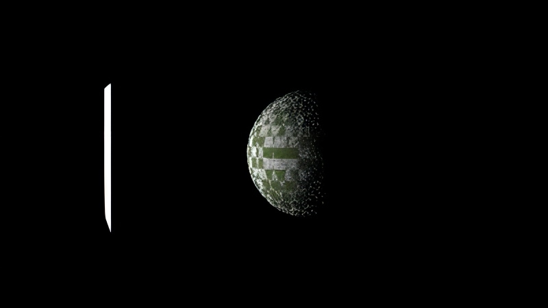

# ray-tracing-in-python

本仓库代码为[Ray Tracing in One Weekend](https://raytracing.github.io/)系列的Python实现。该系列共含三本书，本仓库实现了第一本书的全部和第二本书的部分。

- [book1](https://raytracing.github.io/books/RayTracingInOneWeekend.html)包括渲染球体、反走样、材质模型（漫反射、金属和电解质）和摄像机位置。
- [book2](https://raytracing.github.io/books/RayTracingTheNextWeek.html)包括动态模糊、包围盒、纹理贴图、柏林模糊、四边形和光照模型。

以上内容在知乎上也有对应的理解，请参考[这篇](https://zhuanlan.zhihu.com/p/692188990)和[这篇](https://zhuanlan.zhihu.com/p/699263679)文章。更多详细内容请参考[官方教程](https://raytracing.github.io/)以及[官方C++实现](https://github.com/RayTracing/raytracing.github.io/tree/release/src)

